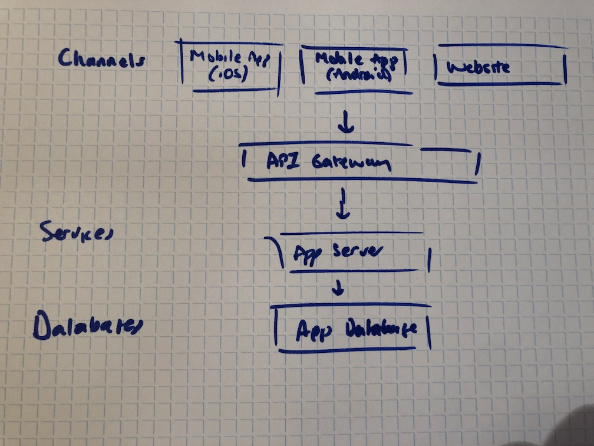

# architecture-as-code

[](https://circleci.com/gh/dwmkerr/architecture-as-code) [](https://codecov.io/gh/dwmkerr/architecture-as-code)

A project to help define architecture logically as code, and generate living, interactive diagrams.

<!-- vim-markdown-toc GFM -->

* [Design Goals](#design-goals)
* [High-Level Requirements](#high-level-requirements)
* [Technical Notes](#technical-notes)
* [Examples](#examples)
    * [A simple, three tier application](#a-simple-three-tier-application)
* [Other Ideas](#other-ideas)
    * [Policy Enforcing](#policy-enforcing)
* [Alternatives](#alternatives)
* [Technical Design](#technical-design)
* [The CLI](#the-cli)
* [API Documentation](#api-documentation)
    * [Validate](#validate)
* [Developer Guide](#developer-guide)
* [TODO](#todo)

<!-- vim-markdown-toc -->

## Design Goals

The goals of this project are to allow a team to define architecture declaratively, as simple [`yaml`](https://yaml.org/) files, and have interactive diagrams and visualisations generated automatically.

At a high level:

1. Developers and tech leads should be able to collaborate on architecture using standard practices such as pull-requests, code reviews, etc.
2. The 'toil' of generating the diagrams and artifacts should be eliminated.
3. The system should be simple enough to very quickly define an architecture at a high-level, then layer on details as needed.
4. The system should allow 'multidimensional' models, allowing logical architecture to be defined, but also allow the viewer to 'dive' into lower level details, such as physical or network infrastructure if needed.
5. The system should allow UI developers to rapidly create 'styles' for renderings, or custom renderers for typed entities.

## High-Level Requirements

A team should be able to use a `yaml` file to represent logical or physical architecture. There are three types of entities:

**Components**

A component is any logical or physical entity. It might be a system, such as an ESB, a server, a switch, and storage service, and so on.

**Containers**

A *conatainer* is any logical grouping of components. It could be a logical container (such as 'Front End Services'), or a technical container (such as an AWS region).

**Connections**

A *connection* is a relationship between components or containers. It could be logical, such as a dependency between a service and a database, or a technical connection, such as a potential HTTP connection between a mobile app and a web server, via a gateway.

**Level**

A 'level' is an optional concept which may represent a 'zoom' of the diagram. For example, level 1 in a diagram might be the high level architecture. Level 2 might be the specific services and systems, level 3 might be the physical infrastructure on which an instance resides. By providing levels, diagrams should be able to be 'zoomed' as needed.

**Aspect**

An 'aspect' is a 'view' of the system. For example, the infrastructure aspect might only show physical and network infrastructure for the on-premise data center, which the 'cloud' aspect might show only the cloud components.

## Technical Notes

The in-memory structure may be best represented as a graph.

Containers, components and connections should be rendered in a simple 'boxes and lines' fashion.

It should be possible to give a container, component or connection a 'type', from a pre-defined library. For example, a specific type might be an 'EC2 Instance'. Each type has a schema, of required and optional fields. Each type should also have an associated 'renderer', which allows the type to be rendered in a specific way (for example, an EC2 instance might be rendered with the AWS EC2 logo, with the instance name at the lower side and the instance type at the upper right side).

It should be possible to associate arbitrary metadata with entities, to allow custom rendering if needed.

It should be possible to specify 'levels'. Levels would 

## Examples

Below are a few examples, highlighting a proposed format.

### A simple, three tier application

The code might look like this:

```yaml
title: Three Tier Application
author: Dave Kerr

---

container:
  id: channels
  name: Channels

container:
  id: services
  name: Services

container:
  id: databases
  name: Databases

component:
  name: Mobile App (iOS)
  container: channels

component:
  name: Mobile App (Android)
  container: channels

component:
  name: Website
  container: channels

component:
  id: api_gateway
  name: API Gateway

component:
  name: Application Server
  container: services

component:
  name: Application Database
  container: databases

connection:
  from: channels
  via:
    - api_gateway
  to: services

connection:
  from: services
  to: databases
```

The resulting diagram should be rendered as something like this:



## Other Ideas

Some additional features would would be useful:

1. Creating a structure from Terraform files
2. Creating a model from an external structure, such as AWS
3. Layering data from an APM such as New Relic in real-time
4. WebGL rendering

### Policy Enforcing

Enforce policies. Go to AWS, highlight any resource which is not part of an architecture schema. Allows existing environments to be audited, e.g show me resources which don’t fit into my defined architecture. This is potentially quite a useful feature, allowing an existing cloud set up to be audited against a well defined architectural spec.

## Alternatives

Current solutions which are similar in nature:

- [Structurizr](https://structurizr.com/): Create diagrams based on Markdown or AsciiDoc

## Technical Design

1. Parser: The parser will read the yaml file, validate it for syntax and structure, then produce an in-memory model. Suggested implementation is a Node.js module which can be run in-memory to validate the structure, and load into an in-memory representation, or as a cli to vlidate from the commandline. This will allow validation to happen as part of a CI/CD process, to allow Pull Requests on the structure to be validated.
2. Visualiser: The visualiser will use the parser to build the in-memory model, which will be rendered to an HTML5 Canvas (or perhaps in 3D). Suggested implementation is a simple HTML SPA.

```
  model.yaml  --> validator --> warnings, errors, model.json
  model.json  --> inflator  --> warnings, errors, model-inflated.json
  model-inflated --> renderer --> visualisation
```

Other options:

- A CLI to render a PNG of the diagram, potentially highlighting a 'diff' for a pull request.

## The CLI

Some ideas for the CLI interface:

```
aac validate # validate a model
aac render   # render a model
aac import   # create a model from an external structure
aac diff     # compare models, or a model to an external structure
```

- Consider yargs rather than commander
- Consider inquirer for cli guidance

## API Documentation

The key APIs are documented below.

### Validate

Validates the structure of a model YAML, and returns the in-memory representation of the model:

```js
const modelYaml = fs.readFileSync('model.yaml', 'utf8');
const { model, errors, warnings } = validate({ modelYaml });

console.log(`${errors.length} errors`);
console.log(`${warnings.length} warnings`);
console.log(`Model: ${JSON.stringify(model, null, 2)}`);
```

## Developer Guide

Common tasks can be run from the `makefile`

| Command       | Usage                                                        |
|---------------|--------------------------------------------------------------|
| `make test`   | Lint and test the code.                                      |
| `make circle` | Install the CircleCI CLI and run the CircleCI build locally. |

## TODO

- [ ] `aac ./some/file.yaml` shows no output - it should demand a command
- [ ] `meta` field on anything, just key value pairs. Use it as a 'dumping ground' (e.g. `platform: as400`) when building models, until you find a structured location for it. When rendered, available as a tooltip.
- [ ] styling should be handled with a separate css file, which can use classes, selectors etc. Regardless of whether the renderer is HTML, CSS provides a known framework for styling.
- [ ] `aac demo` - creates a three-tier architecture, renders and watches it, with an informative message. One command to show all the good stuff.
